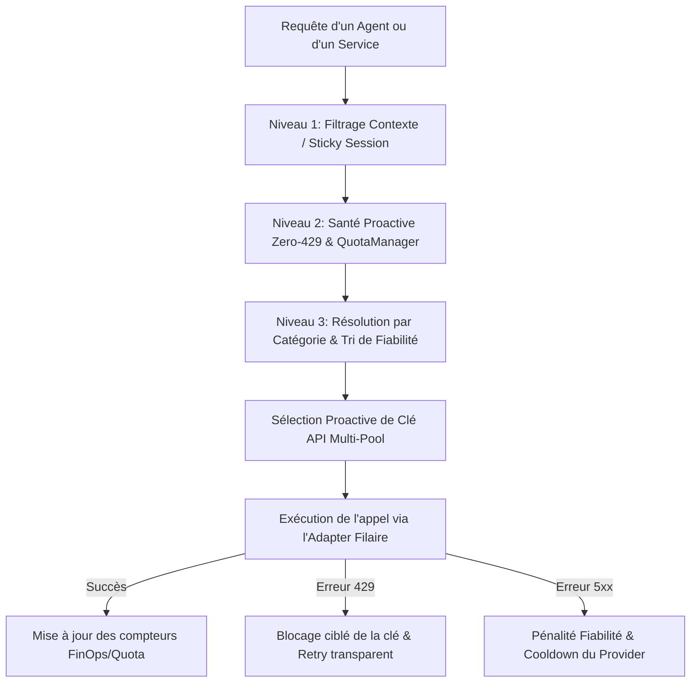

# 🛡️ Architecture du Smart Router V2 & Système Proactif Anti-429

## 1. Problématique & Objectif Systémique

Dans une application s'appuyant massivement sur des modèles de langage (LLM) distribués chez divers fournisseurs (OpenAI, Anthropic, Google Gemini, Groq, Kimi, etc.), deux obstacles majeurs surviennent :

1. **L'erreur HTTP 429 ("Rate Limit Exceeded / Quota Exhausted")** : survient lorsqu'une clé API ou un modèle dépasse le nombre maximal d'appels autorisés par minute ou par jour.
2. **L'instabilité ou l'indisponibilité d'un fournisseur** : pannes de service, latences anormales ou erreurs HTTP 5xx.

L'objectif du **Smart Router V2** est d'assurer la **continuité absolue de service (Zero-429)**. Il empêche le blocage d'une requête en prévoyant dynamiquement les dépassements de quota _avant_ qu'ils ne se produisent (détection proactive), et en réagissant instantanément aux échecs réseau (résilience réactive).

---

## 2. Vue d'Ensemble de la Cascade de Routage (3 Niveaux)

Chaque requête émise vers un modèle d'IA traverse un entonnoir de décision en trois niveaux, géré par la classe centrale [`ProviderRouter`](file:///home/omni/Code/HIVE-MIND-RAILWAY/src/providers/index.ts#L275-L1395) :



### Niveau 1 : Filtrage par Contexte (_Sticky Session_)

Si l'application a explicitement verrouillé un fournisseur ou un modèle pour garantir la cohérence d'une session conversationnelle (par exemple, forcer l'usage d'Anthropic pour un raisonnement complexe), ce fournisseur est sélectionné en priorité.

### Niveau 2 : Filtrage Proactif de Disponibilité (_Zero-429 Health Check_)

Avant même de contacter le serveur distant, le routeur interroge le [`QuotaManager`](file:///home/omni/Code/HIVE-MIND-RAILWAY/src/services/quotaManager.ts#L80-L450). Ce dernier calcule la consommation récente sur trois axes :

- **RPM** (_Requests Per Minute_) : Nombre de requêtes émises dans les 60 dernières secondes.
- **TPM** (_Tokens Per Minute_) : Volume de jetons de texte consommés dans les 60 dernières secondes.
- **RPD** (_Requests Per Day_) : Nombre de requêtes quotidiennes.

Pour éviter d'atteindre la limite stricte imposée par le fournisseur, le routeur applique une **marge de sécurité proactive** (par défaut **20% sur le RPM**, **10% sur le TPM**, **5% sur le RPD**). Un modèle ayant dépassé 80% de son quota autorisé par minute est préventivement retiré de la liste d'exécution pour la requête en cours.

### Niveau 3 : Résolution par Catégorie de Tâche & Tri par Fiabilité

Si plusieurs modèles sont utilisables, le routeur résout la catégorie fonctionnelle de la demande (ex: `AGENTIC` pour du code/agent, `FAST` pour une réponse rapide, `VISION` pour de l'image).
Chaque catégorie définit un **couple primaire / secours (_fallback_)**. Les modèles candidats sont ensuite triés selon leur **Score de Fiabilité Historique** (voir Section 4).

---

## 3. Le Gestionnaire de Quotas & Caching à Deux Niveaux (QuotaManager)

Le composant [`QuotaManager`](file:///home/omni/Code/HIVE-MIND-RAILWAY/src/services/quotaManager.ts) est le cœur analytique de l'anti-429.

### A. Stratégie de Caching L0 / L1

Pour évaluer la santé d'un modèle en moins d'une milliseconde sans surcharger la base de données de métriques :

- **Cache L0 (En mémoire vive local, TTL de 2 secondes)** : absorbe la répétition des vérifications rapides pendant un même cycle de routage.
- **Cache L1 (Base Redis distribuée)** : maintient les compteurs atomiques synchronisés en temps réel entre toutes les instances du système, avec expiration automatique (60s pour RPM/TPM, 48h pour RPD).

### B. Rotation Multi-Clés (_Multi-Key Rotation_)

Pour un même fournisseur et un même modèle, le système peut enregistrer un ensemble de clés API (`k1`, `k2`, `k3`, ...).
Lorsqu'un modèle est sollicité :

1. Le `QuotaManager` évalue simultanément et en parallèle l'état de consommation de l'ensemble des clés disponibles (`Promise.all`).
2. Il retient automatiquement la **première clé saine** dont les compteurs restent sous les marges de sécurité.
3. Si la clé `k1` approche de sa saturation, le routeur bascule sur `k2` de manière 100% transparente pour l'utilisateur.

---

## 4. Mécanismes de Résilience en Temps Réel

Quand une requête est émise vers l'extérieur, deux circuits réactifs surveillent la réponse :

```text
                +-----------------------------------------+
                |           Exécution de l'appel          |
                +-----------------------------------------+
                                     |
                  +------------------+------------------+
                  |                                     |
           [ Erreur 429 Quota ]                 [ Erreur Non-Quota 5xx ]
                  |                                     |
                  v                                     v
   +------------------------------+     +-------------------------------+
   | 1. Lecture en-tête / Retry-After|     | 1. Incrément Reliability Score |
   | 2. Isolement Clé/Modèle (Frigo)|     | 2. Circuit Breaker Exponentiel |
   | 3. Commutation instantanée k+1|     | 3. Re-tri des modèles         |
   +------------------------------+     +-------------------------------+
```

### A. Feedback Temps Réel & Isolation Ciblé (_Key & Model Isolation_)

Lorsqu'un fournisseur renvoie malgré tout une erreur HTTP 429 :

- Le routeur inspecte le message d'erreur et les en-têtes HTTP à la recherche du délai d'attente exact demandé par l'API (ex: `retry in 14.5s`).
- Il applique immédiatement un **blocage temporaire (mise en frigo)** sur le triplet spécifique `(Modèle, Clé API, Provider)` pour cette durée (ou 60s par défaut).
- **Isolation stricte** : Le blocage est appliqué uniquement sur la clé et le modèle défaillants. Les autres clés du même fournisseur ou d'autres modèles restent parfaitement fonctionnels.
- **Boucle de Re-tentative Intérieure** : Le routeur tente immédiatement la clé suivante (`k+1`) sans annuler la tâche globale.

### B. Circuit Breaker de Provider

Si une famille entière de providers accumule des erreurs d'infrastructure répétées :

- Un disjoncteur (_Circuit Breaker_) déclenche un temps de refroidissement (_cooldown_) progressif de la famille : **1 minute**, puis **5 minutes**, puis **15 minutes**.
- Pendant ce délai, le routeur saute instantanément cette famille sans émettre de requête réseau inutile.

### C. Score de Fiabilité & Déclin Temporel (_Reliability Scoring & Half-Life Decay_)

Les erreurs qui ne sont pas liées à des quotas (erreurs serveur 500, timeouts réseau) modifient la note de fiabilité du modèle :

- Chaque échec ajoute +1 au score d'échec du modèle (plafonné à 10).
- Les modèles ayant un score élevé sont relégués à la fin de la file d'attente de la cascade.
- **Déclin exponentiel à demi-vie (30 min)** : Le score s'estompe naturellement de 50% toutes les 30 minutes de stabilité, permettant aux modèles rétablis de revenir progressivement au premier plan.

### D. Mode SECOURS (_Emergency Fallback_)

Si la totalité des fournisseurs prioritaires d'une catégorie sont saturés ou indisponibles, le routeur déclenche le mode **SECOURS** : il abaisse dynamiquement ses marges de sécurité de 20% à **5%**, permettant d'exploiter les toutes dernières capacités disponibles avant un rejet de requête.

---

## 5. Régulation Budgétaire Économique (FinOps & KKT Lagrangian Throttling)

Le Smart Router n'assure pas seulement la stabilité technique ; il intègre une régulation budgétaire basée sur la théorie de l'optimisation mathématique (Conditions de Karush-Kuhn-Tucker - KKT) :

- Un multiplicateur de Lagrange ($\lambda$) mesure la vitesse de consommation du budget global alloué à la session.
- Si le taux de consommation s'accélère ($\lambda > 0.05$), le routeur applique un **bridage dynamique de la longueur maximale des réponses** (`max_tokens`).
- Ce mécanisme préserve la continuité de la tâche agentique en réduisant la verbosité des réponses sans jamais interrompre le traitement.

---

## 6. Architecture Générique Découplée (Axes Protocole × Headers)

Sur le plan de l'ingénierie logicielle, le routeur utilise un modèle à **deux axes orthogonaux** déclarés dans [`models_config.json`](file:///home/omni/Code/HIVE-MIND-RAILWAY/src/config/models_config.json) :

```text
                  Architecture à Deux Axes (Orthogonaux)

                  FAMILLE DE PROTOCOLE (Structure du payload)
                  ├── OpenAI-Compatible
                  └── Anthropic-Compatible
                                  ×
                  FAMILLE DE HEADERS (Authentification & En-têtes)
                  ├── StandardBearer (Authorization: Bearer <key>)
                  ├── ClaudeCode (x-api-key + custom headers)
                  └── Custom Providers (Kimi, Kimi-Coding, etc.)
```

Grâce à la classe [`GenericProviderAdapter`](file:///home/omni/Code/HIVE-MIND-RAILWAY/src/providers/GenericProviderAdapter.ts), ajouter un nouveau fournisseur compatible OpenAI ou Anthropic ne nécessite **aucun code source supplémentaire**. Il suffit de déclarer la liaison entre son protocole et sa famille d'en-têtes dans le fichier de configuration JSON.

---

## 📘 Lexique des Termes Techniques

| Terme                         | Définition Conceptuelle                                                                                                                                                                                                                                      |
| :---------------------------- | :----------------------------------------------------------------------------------------------------------------------------------------------------------------------------------------------------------------------------------------------------------- |
| **HTTP 429**                  | Code de statut officiel du protocole HTTP signifiant que le client a envoyé trop de requêtes dans un temps donné (_Rate Limit_).                                                                                                                             |
| **RPM / TPM / RPD**           | Métriques de débit : _Requests Per Minute_ (nombre d'appels par minute), _Tokens Per Minute_ (volume de mots/jetons traités par minute), _Requests Per Day_ (limite quotidienne).                                                                            |
| **Circuit Breaker**           | Pattern de conception logicielle inspiré des disjoncteurs électriques : si un composant échoue de manière répétée, le système coupe temporairement les requêtes vers ce composant pour lui laisser le temps de récupérer et éviter de bloquer l'application. |
| **Sticky Session**            | Mécanisme garantissant que les requêtes successives d'un même échange restent routées vers le même modèle/fournisseur afin d'éviter la perte de contexte ou d'incohérences de comportement.                                                                  |
| **Half-Life Decay**           | Algorithme de dépréciation temporelle exponentielle (analogue à la demi-vie radioactive) réduisant progressivement l'impact des erreurs passées au fil du temps.                                                                                             |
| **KKT Lagrangian Throttling** | Technique de régulation de flux inspirée de l'optimisation sous contraintes mathématiques, réduisant la taille des réponses générées au fur et à mesure que le budget disponible diminue.                                                                    |

---

### 🔍 Fichiers de Référence dans le Codebase

- Router Central : [`src/providers/index.ts`](file:///home/omni/Code/HIVE-MIND-RAILWAY/src/providers/index.ts)
- Gestionnaire de Quotas & Santé : [`src/services/quotaManager.ts`](file:///home/omni/Code/HIVE-MIND-RAILWAY/src/services/quotaManager.ts)
- Configuration des Modèles & Cascades : [`src/config/models_config.json`](file:///home/omni/Code/HIVE-MIND-RAILWAY/src/config/models_config.json)
- Adaptateur Générique : [`src/providers/GenericProviderAdapter.ts`](file:///home/omni/Code/HIVE-MIND-RAILWAY/src/providers/GenericProviderAdapter.ts)
